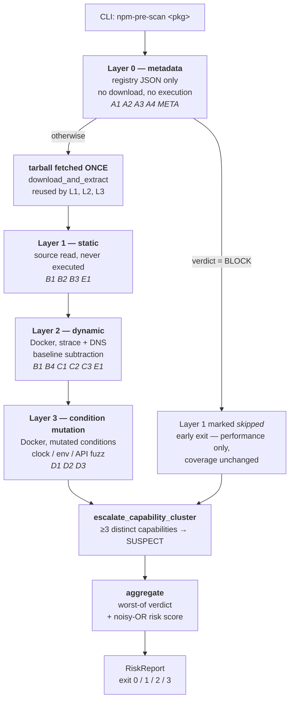
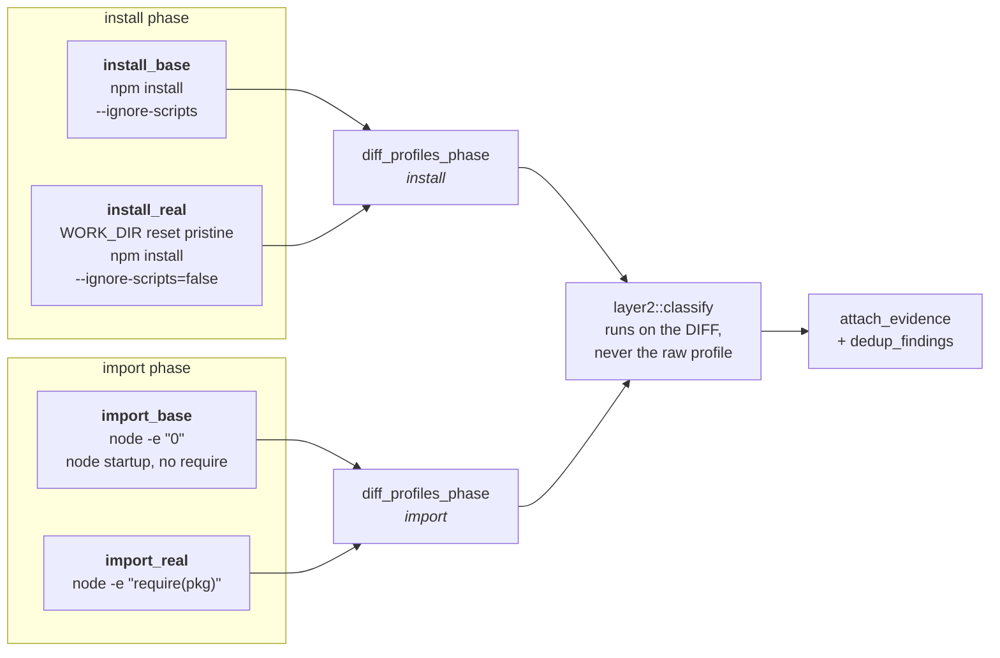
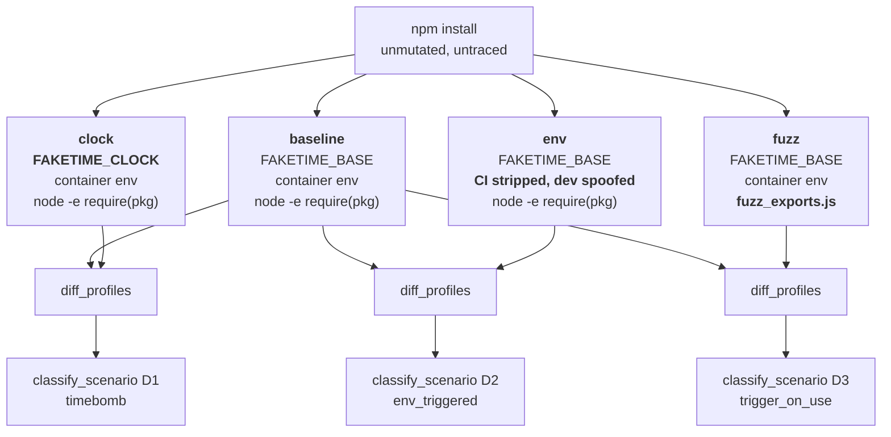
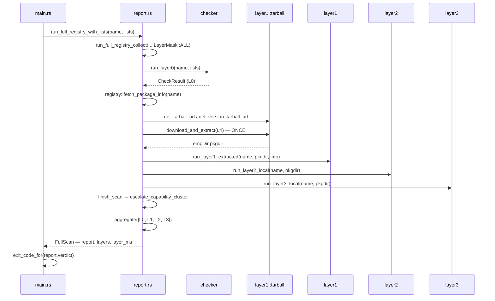

# npm-pre-scan — Comprehensive Project Report

**A unified npm supply-chain scanner spanning registry metadata to active dynamic condition
mutation, implemented in Rust (Layers 0–1) and Docker + shell (Layers 2–3).**

---

## 0. Front matter

### 0.1 Abstract

`npm-pre-scan` screens an npm package for supply-chain malware *before* it is installed. It runs
four sequential layers over a single package identity — Layer 0 reads registry metadata only,
Layer 1 reads package source without executing it, Layer 2 executes the package inside a
network-isolated Docker container and subtracts a behavioural baseline, and Layer 3 re-executes it
under *deliberately mutated conditions* (a pinned-and-advanced clock, a spoofed developer
environment, and an exported-API fuzzer) to provoke payloads that stay dormant under passive
observation. Findings from all four layers aggregate into one verdict and one reported risk score.

The tool's research claim is narrow and specific: existing state-of-the-art dynamic detectors
observe install-, import- and run-time behaviour but do not *actively trigger* conditions, so
condition-gated attacks — time bombs, environment-gated payloads, trigger-on-use payloads — remain
invisible to them. Layer 3 addresses exactly that gap. Every in-scope attack vector is implemented
and live-verified; the tool has been measured against 216,888 real malicious package names, 499
real malicious payloads, and 27 legitimate popular packages.

### 0.2 Provenance of every number in this report

| | |
|---|---|
| Report revision | R1 — 2026-09-02 |
| Code revision described | branch `accuracy-pass-capability-model`, tool version v19 |
| Working-tree state | **v19 work uncommitted** (929 insertions across 11 files; `eval/baseline/v19/` untracked). `cargo check --all-targets` clean. |
| Measured figures sourced from | `eval/baseline/v19/arm{A..F}.metrics.json` |
| Historical figures sourced from | `eval/baseline/v17/`, `eval/baseline/v18/` — always labelled inline |

**Convention:** every measured figure in this report carries an inline provenance tag of the form
*(arm F, v19)*. An untagged number is a code constant, not a measurement. Sections 7, 8 and 9 are
the only sections containing measurements — Parts II and III are version-independent by
construction, so a v20 re-measurement touches three sections and the table above, nothing else.
See Appendix A for the refresh checklist.

### 0.3 How to read this report

The document is deliberately split. Neither audience needs the other's part.

| If you are… | Read | You can skip |
|---|---|---|
| A research / thesis reader | §0.1, **Part I (§1–§9)**, Appendix C | Parts II and III |
| An engineer taking over the code | §0.1, **Part II (§10–§16)**, **Part III (§17–§20)**, Appendix B | Part I, except §3 (scope) and §5 (vector index) |
| Reviewing what the tool has actually demonstrated | §7, §8, §9 | everything else |

### 0.4 What this report owns, and what it does not

This repository has a **documented history of duplicated documentation drifting apart** until the
copies contradicted each other: `CLAUDE.md` once carried a second copy of the attack-vector
coverage matrix, and the two diverged until the copy claimed 36 B2 false positives where the real
figure was 18. `CLAUDE.md` now carries an explicit instruction not to reintroduce it.

This report therefore **references rather than forks**. It owns the cross-cutting synthesis: the
end-to-end narrative, the dual-audience sequencing, the traced execution paths, and the three
empirical findings of §8 (which exist today only scattered across per-arm sections of
`eval/REPORT.md`). It does not re-host anything below.

| Document | Owns | This report's relationship |
|---|---|---|
| `README.md` | The per-vector coverage matrix with measured `fires`/`FP` columns; per-check severity ladders; the exhaustive file tree; build & usage reference | §5 carries a code-mapping index only, never the measured columns. §17 organises by responsibility rather than replicating the tree. |
| `CLAUDE.md` | The v14+ change log; the fix queue (Task Checklist); canonical research wording; environment notes | §9 and §20 summarise and point; the living checklist is not copied. |
| `eval/REPORT.md` | The full per-arm measurement narrative; the nine ranked weaknesses | §7 and §8 synthesise across arms; §9 condenses the weaknesses to a table. |
| `eval/README.md` | Harness mechanics; manifest column spec; corpus safety and legal posture | §16 covers design decisions only, not the spec. |

> **Note on links.** `README.md`'s sections are plain-text banners between dashed rules, not
> Markdown headings, so they have no anchors. References to it name the banner text to search for
> (e.g. `README.md` → banner `ATTACK-VECTOR COVERAGE`) rather than offering a link that would not
> resolve.

---
---

# Part I — Research report

*Audience: research / thesis reader. Self-contained; Parts II and III are not prerequisites.*

## 1. Purpose and problem statement

An npm package is not inert data. `npm install` executes `preinstall`, `install`, `postinstall`
and `prepare` hooks from the package and from every transitive dependency, with the invoking user's
full privileges, before any of that code has been reviewed. A `require()` of the installed module
then executes its top-level body. The consequence is that **the decision to install is the decision
to execute**, and it is taken by a developer reading a package name, or by a lockfile resolution
nobody read at all.

This is what makes npm the highest-value target among package ecosystems, and it is the reason this
tool positions itself *before* installation rather than after. Post-hoc detection — an advisory
feed, a takedown, a CVE — arrives after the payload has run. A pre-installation screen is the only
control point at which a consumer can still decline.

The specific problem this tool addresses is narrower than "detect npm malware." It is:

> Given only a package name (or a local package directory), and acting purely as a downstream
> consumer with no privileged access to the registry, the repository, or the build system — decide
> whether installing this package is safe, **including when the malicious behaviour is gated behind
> a condition that will not hold during analysis.**

That final clause is the research contribution. A payload that checks `new Date() >= <trigger>`, or
`process.env.CI === undefined`, or that fires only when a consumer calls a specific exported
function, is *not detected by observing an installation and an import*. It is dormant precisely
when it is being watched.

## 2. Positioning against prior work

Three systems define the state of the art in dynamic npm malware detection, and all three are
comparison targets for this tool:

| System | Venue | What it observes | The gap |
|---|---|---|---|
| **MalOSS** — Duan et al. | NDSS 2021 | Install-, import- and run-time behaviour via a metadata + static + dynamic pipeline | Its own authors characterise the dynamic testing as simplistic; it observes what a package *does*, not what it *would do* under other conditions |
| **OSCAR** — Zheng et al. | ASE 2024 | Install/import behaviour with improved instrumentation and reporting | No condition mutation — an unmet trigger is an unobserved payload |
| **DONAPI** — Huang et al. | USENIX Security 2024 | Large-scale static + dynamic API-sequence analysis over the npm corpus | Same limitation: passive observation of the default execution path |

All three share one structural property: **they observe passively**. They install the package,
import it, watch what happens, and classify what they saw. That is sound for payloads that fire
unconditionally. It is systematically blind to payloads that do not.

`npm-pre-scan` adds an **active triggering** layer. Rather than only asking *what did this package
do*, Layer 3 asks *what does this package do when the date is later, when it believes it is on a
developer's laptop rather than in CI, and when its exported API is actually called*. The behaviour
that appears only under a mutated condition is, by construction, condition-gated behaviour — and
the mutation that revealed it names the gate.

The classification base for what counts as an attack vector is **Ladisa et al., "SoK: Taxonomy of
Attacks on Open Source Supply Chains," IEEE S&P 2023**, which enumerates 107 vectors across the
whole supply chain. This tool does not claim to cover 107; it claims to cover, completely, the
subset a downstream consumer can detect at install time — and §3 makes that subset explicit.

The tool is an **independent research artifact**. It was formerly coupled to a separate KIISC
four-registry measurement study; that dependency was deliberately dropped because the measurement
study was too small in scale to serve as a justification base. The tool's justification now rests
entirely on the SOTA gap above, and it stands without citing that paper.

## 3. Scope and threat model

**Scope is defined over attack vectors detectable by an npm package consumer at install time.**

| | |
|---|---|
| **In scope** | Vectors reachable *after* a package lands on the npm registry, detectable from the downstream-consumer perspective: naming confusion, malicious package content, condition-gated payloads. |
| **Out of scope** | VCS compromise, CI/CD pipeline injection, build-system tampering. Not because they are unimportant, but because **they are not detectable by a package scanner** — a consumer sees the published artifact, not the pipeline that produced it. |

Declaring that boundary is itself framed as part of the contribution. A tool that claims coverage
of a taxonomy without stating which subset it can reach is making an unfalsifiable claim; stating
the reachable subset makes the coverage claim testable.

Two rules govern coverage inside the boundary:

1. **Every in-scope vector maps to at least one layer.** No in-scope vector may be silently
   skipped. If a vector cannot be reliably detected it must be documented as a known limitation,
   never omitted — which is why §9 exists and is as long as it is.
2. **The early-exit optimisation does not reduce coverage.** A Layer 0 `BLOCK` short-circuits
   Layer 1 (§15.1), but that is a performance choice: the verdict still represents the full
   in-scope vector set, because a package already blocked on its name does not need its source
   read to be refused.

**Threat model.** The adversary controls a package published to the npm registry: its name, its
metadata, its source, its install hooks, and any number of published versions. The adversary may
gate the payload on time, environment, or API invocation, and may obfuscate the payload's source.
The adversary does **not** control the analysing host, the npm registry's signing keys, or the
container runtime. The analysis is assumed to run offline and network-isolated, which is both a
safety property and — as §9 makes clear — the source of the tool's principal remaining limitation.

## 4. Contributions

The project claims two contributions, and the documentation is emphatic that both should be stated
together rather than the second alone:

1. **A unified single tool spanning Layers 0–3** that covers every in-scope npm attack vector, from
   registry metadata through static source analysis to dynamic condition mutation, behind one entry
   point and one aggregate verdict. Prior work distributes these concerns across separate tools with
   separate operating assumptions.
2. **Layer 3 active condition mutation** — clock manipulation, environment spoofing, and API
   fuzzing — which detects time-bomb, environment-triggered, and trigger-on-use payloads that
   existing dynamic detection tools fail to trigger at all.

The project's own one-line statement of the contribution:

> "A unified single npm tool spanning metadata to dynamic analysis that detects condition-gated
> attacks (time-bomb, environment-triggered, trigger-on-use) — which existing dynamic detection
> tools fail to trigger — via active condition mutation (clock manipulation, environment spoofing,
> API fuzzing)."

A third result emerged from the evaluation and is arguably of broader interest than either planned
contribution: **coverage without a measured false-positive rate is not sufficient**, and measuring
it exposed a severity ladder that carried *negative* information. That is §8.

## 5. Attack-vector coverage

Coverage is complete: all in-scope vectors A1–E1 are implemented and live-verified. The table below
is a **code-mapping index** — it answers "which source file implements this vector" so the rest of
this report can cross-reference it.

> **It deliberately omits the measured `fires` and `FP` columns.** Those live in `README.md`
> (banner `ATTACK-VECTOR COVERAGE`), which is the single source of truth for per-vector status and
> evidence. If this index and that matrix ever disagree, the matrix wins.

| ID | Attack vector | Layer(s) | Implementing module |
|---|---|---|---|
| **A1** | Typosquatting | 0 | `src/typosquat.rs` |
| **A2** | Dependency / namespace confusion | 0 | `src/namespace.rs` |
| **A3** | Account hijacking | 0 | `src/maintainer.rs` (capability tier only — see §8.3) |
| **A4** | Combosquatting | 0 | `src/combosquat.rs` |
| **B1** | Install-time script execution | 1 + 2 | `src/layer1/checks.rs::check_install_scripts`, `src/layer2/classify.rs` (`install_script_exec`, `sensitive_file_read`) |
| **B2** | Obfuscation / malicious content | 1 | `src/layer1/checks.rs` (`check_obfuscation`, `check_suspicious_strings`, `check_network_imports`, `check_computed_load`, `check_dynamic_require`) |
| **B3** | Malicious version update | 1 | `src/layer1/version_diff.rs` |
| **B4** | Destructive / persistence (wiper) | 2 + 3 | `src/layer2/classify.rs` (`sensitive_file_write`, `mass_deletion`) |
| **C1** | Import-time execution / egress | 2 | `src/layer2/classify.rs` (`import_side_effect`, `ip_literal_egress`) |
| **C2** | Slow exfiltration / DNS tunnelling | 2 | `src/layer2/classify.rs` (`dns_tunneling`) |
| **C3** | Hidden native binary | 2 | `src/layer2/classify.rs` (`native_addon`) |
| **D1** | Time bomb (date-gated) | 3 | `src/layer3/` — `clock` scenario |
| **D2** | Environment-triggered | 3 | `src/layer3/` — `env` scenario |
| **D3** | Trigger-on-use (API-gated) | 3 | `src/layer3/` — `fuzz` scenario + `docker/fuzz_exports.js` |
| **E1** | Self-propagating worm | 1 + 2 | `src/layer1/worm_signature.rs`, `src/layer2/classify.rs` (`worm_egress`) |
| **META** | Heuristic metadata signals | 0 | `src/age_check.rs`, `src/signatures.rs`; plus the synthetic `capability_cluster` in `src/report.rs` |

Every finding the tool emits carries a `vector` tag from this closed set, so a JSON consumer can map
any detection back to the taxonomy.

**Reading the measured columns in `README.md` — this has caused a documented error.** In that
matrix, `fires` is a *cross-arm total*, while `FP` counts *distinct legitimate packages out of the
27 in `eval/corpus/parent_benign.tsv`, from arm F only* — arm F being the only arm that ran all four
layers over the benign corpus. `metrics.json`'s `by_vector[].false_hits` is a distinct-package count
*within one arm*, so **summing it across arms is meaningless**: `parent_benign.tsv` was scanned in
arms A, B and F, and summing double- or triple-counts the same packages. That is precisely how the
old duplicate matrix came to claim 36 B2 false positives where the real figure is 18.

## 6. Evaluation design

Before v17 every verification the project had performed used a dummy package it had authored
itself. That confirms each layer *works as designed* but cannot produce a recall figure, a
false-positive rate, or an answer to the question "which layer earns its keep." The `--eval`
harness (§16) and a six-arm experiment were built to answer those.

The six arms are not six runs of the same experiment. Each isolates one measurement that the others
cannot make:

| Arm | Corpus | n | Layers | The one question it answers |
|---|---|---|---|---|
| **A** | OSV `MAL-*` names + benign parents | 216,888 | L0 name-only, offline | How does Layer 0's name analysis behave at registry scale, fully reproducibly and with zero network? |
| **B** | Real malicious npm names + benign parents | 65 | L0 / L0+L1, live registry | How does the shipped pipeline behave against names attackers actually chose? |
| **C** | The project's own fixtures | 19 | L0–L3 | Does each vector's detector still fire on the vector it was built for? (functional regression) |
| **D** | DataDog real malicious payloads | 499 | L1 only | What is Layer 1's static recall on real malicious *code*? |
| **E** | DataDog real malicious payloads | 40 | L1+L2+L3 | What does the full dynamic pipeline add over static alone, on real payloads? |
| **F** | Legitimate popular packages | 27 | L0–L3 | **What is the false-positive rate?** Arm F is the only arm that runs all four layers over the benign corpus, and therefore the only source of an FPR. |

Three design decisions make these numbers defensible, and all three were forced by problems
encountered while building the harness:

- **Two operating points are always computed side by side.** `overall` treats BLOCK-*or*-SUSPECT as
  a positive; `overall_block_only` treats BLOCK alone as a positive. Reporting only one of them
  hides exactly the failure §8.1 describes.
- **Real malicious payloads cannot come from npm.** npm's takedown process replaces a malicious
  package with either a 404 or a "security holding" stub — and some stubs *retain the original
  version number* while being republished defanged. This was verified live: `crossenv@1.0.0`,
  `ffmepg@1.0.2` and `jquery.js@1.0.2` contain only
  `console.log('this package is no longer dangerous')`. Scanning them measures nothing about
  detection. Real payloads therefore come from the `DataDog/malicious-software-packages-dataset`
  (Apache-2.0), and a takedown stub that scans clean is recorded as `artifact_fn` — excluded from
  recall's denominator, because a PASS on a defanged stub is *truthful*.
- **A zero denominator serialises as `null`, never `0.0`.** Every rate in `metrics.json` is an
  `Option<f64>`. Arm D has no benign entries, so its FPR is `null` — not a flattering zero.

## 7. Headline results

All figures *(v19)* unless labelled otherwise, read from `eval/baseline/v19/arm{A..F}.metrics.json`.

| Arm | n | Any-finding (BLOCK or SUSPECT) | BLOCK-only | Wall clock |
|---|---|---|---|---|
| **A** | 216,888 | 2,841 names flagged; FP 1 / 27 | 485 names flagged | 61.1 s |
| **B** | 65 | recall **85.7%**, FPR 46.7% | recall 84.2%, FPR **0.0%** | 25.0 s |
| **C** | 19 | recall **100%** (16/16), FPR 0.0% | recall 56.3% (9/16) | 777.5 s |
| **D** | 499 | recall **87.6%**, precision 100% | recall 35.1% | 6.1 s |
| **E** | 40 | recall **97.5%** (39/40) | recall 65.0% | 1,361.5 s |
| **F** | 27 | **FPR 48.1%** (13 FP / 14 clean) | **FPR 0.0%** (0 FP / 27 clean) | 1,441.8 s |

The precision trend across the three measured versions, arm F — the arm that matters for
false positives:

| | v17 | v18 | v19 |
|---|---|---|---|
| Any-finding FPR | 96.3% (26 of 27 accused) | 70.4% (19 of 27) | **48.1%** (13 of 27) |
| BLOCK-only FPR | 44.4% (12 of 27 hard-blocked) | **0.0%** | **0.0%** |
| Legitimate packages completely clean | 1 (`chalk` alone) | 8 | **14** |

And the recall floors held while that happened:

| | v17 | v18 | v19 |
|---|---|---|---|
| Arm D recall (499 real payloads, L1) | 88.8% | 88.8% | 87.6% |
| Arm D BLOCK-level recall | 37.5% | 21.6% | **35.1%** |
| Arm E recall (40 real payloads, all layers) | 95.0% | 97.5% | **97.5%** |

**What this says.** As of v19 the tool hard-blocks no legitimate package in the benign corpus, while
catching 39 of 40 real malicious payloads through the full pipeline and 437 of 499 with static
analysis alone. Just over half the benign corpus now passes completely clean. The remaining 48.1%
any-finding rate is a real limitation and §9 addresses it without softening it.

Two results deserve to be stated as plainly as the problems, because they validate specific design
choices rather than the tool as a whole:

- **E1 is validated against real malware, not a fixture.** The single real-world IOC hash in
  `data/worm_iocs.txt` matched the actual Shai-Hulud patient-zero sample (`@ctrl/tinycolor@4.1.1`),
  all three worm heuristic categories fired independently, and E1 recall on the hand-labelled
  Shai-Hulud samples is 4/4.
- **Layer 2's baseline subtraction is genuinely precise.** Zero false positives across the ten
  legitimate, dependency-free packages that could be dynamically analysed — the first time the
  mechanism was measured against real software rather than a two-line dummy.

## 8. Three empirical findings

These three results are findings *about detector design*, not changelog entries, and they outlive
this codebase. Today they exist only distributed across per-arm sections of `eval/REPORT.md`, which
is why they read there as three unrelated incidents rather than one argument. Synthesised, the
argument is: **a detection rule's severity is a claim about discrimination, and an unmeasured
severity ladder can carry information in the wrong direction.**

### 8.1 A severity ladder that carried negative information

The v17 measurement produced a result that should not be possible in a working detector:

| BLOCK fired on… | v17 rate |
|---|---|
| Legitimate packages (arm F, 27 popular packages) | **44.4%** |
| Real malicious packages (arm D, 499 real payloads) | **37.5%** |

BLOCK — the tool's highest-confidence severity, the one that refuses installation — fired *more
often on legitimate software than on actual malware*. The severity ladder was not merely
uninformative; it was **inverted**. A consumer would have been better off ignoring it.

The root cause was a single check, and it was a time bomb in the literal sense. npm rotated its
registry signing key; the old key expired 2025-01-29. `signatures.rs` filtered expired keys *out of
the key lookup*, so for any package not republished since that rotation it found no matching key,
verified nothing, and returned BLOCK — reading "no unexpired key matches this signature" as evidence
of tampering. This one check accounted for **11 of the 12** BLOCK-level false positives, and its
error rate was *increasing monthly*, since every month adds packages that have not been republished.

The fix inverts the logic: verify against the key that *actually signed* the artifact, and treat
expiry as informational. BLOCK is now reserved for a signature that verifies and fails; an
unpublished key ID is SUSPECT. Measured after: **45 of 45 signature findings are INFO**, and arm B's
BLOCK-level false positives went 14 → 0.

The inversion is gone. Quoting both sides from the same version, as one must: v19 BLOCK fires on
**0.0%** of legitimate packages and **35.1%** of real malicious ones.

**The methodological lesson** is not "we had a bug." It is that the bug was undetectable without a
benign corpus. Every functional test passed; the check did exactly what it was written to do. Only
measuring the same severity against both classes revealed that the severity itself was
anti-correlated with maliciousness.

### 8.2 A recall number corrected downward, on purpose

v17's headline arm B recall was **91.4%**. It is now **85.7%**, and the honest description of what
happened is a *drop from 25.7%*, not a drop from 91.4%.

The v17 figure was mostly an artifact of the same `signatures` bug: 23 of arm B's 32 true positives
were that check firing on **npm's own security-holding stubs**. A stub exists because npm already
took the package down. Detecting it is post-hoc takedown information that a consumer gets for free
from any advisory feed — it is not detection, and counting it as recall inflates the number with
information the tool did not produce.

Fixing the check was therefore *expected* to collapse arm B recall from 91.4% to roughly 25.7%, and
the project pre-registered that prediction rather than discovering it afterwards. It landed at
85.7% instead, because an independent fix in the same pass repaired real name detection: A1 gained
suffix-squat folding (a trailing `.js` / `-js` / `_js` is folded before the distance comparison) and
absent-parent handling. All 18 of the current true positives now come from **A1**, actual name
analysis, rather than from a signature check reporting a takedown.

So the comparison that means something is **25.7% → 85.7%**, and `CLAUDE.md` carries an explicit
instruction not to revert the signature fix in order to restore the 91.4%.

**The methodological lesson**: a recall number is only as meaningful as the mechanism producing it.
An aggregate recall figure that does not attribute detections per-check can hide the fact that the
detector is reading the answer off the back of the book. Per-check attribution — the harness's
`sole_detector` field — is what made this visible.

### 8.3 Rules that were measurably inverted, and the capability tier they produced

With both a malicious corpus (arm D, 499 packages) and a benign corpus (arm F, 27 packages)
measured under identical rules, each Layer 1 rule's *lift* — how much more often it fires on malware
than on legitimate code — became computable. Four rules failed:

| Rule | Fires on malicious | Fires on legitimate | Lift |
|---|---|---|---|
| `suspicious_strings` on `process.env` | 36.3% | **44.4%** | **0.82** |
| `dynamic_require` | 7.6% | **14.8%** | **0.51** |
| `obfuscation`, long-base64 literal | 8.6% | 7.4% | 1.16 |
| `maintainer` change (A3) | — | 11.1% | **zero true positives, ever** |

Two of the four are *inverted* — lift below 1.0 means the rule is evidence of legitimacy. And this
is not mysterious in hindsight: **reading the environment is what configuration is**, and a bundler
emits `require(variable)` by construction. The `process.env` rule alone reached 12 of the 27
legitimate packages, making it the single largest false-positive source in the tool. A3 had produced
no true positive across every arm ever run.

The obvious response — delete them — would have been wrong, and this is the finding. A package that
reads the environment *and* resolves modules dynamically *and* ships an encoded blob is a materially
different proposition from one that merely does any single one of those. The signal is in the
**conjunction**, not the individual terms.

So severity gained a third tier. A finding may now be tagged as a **capability**: emitted as INFO,
never accusing on its own, and escalated to a synthetic `capability_cluster` SUSPECT finding only
when a package carries **three or more distinct capability ids**. The threshold is calibrated rather
than chosen: at 2, arm D's recall floor holds but arm F keeps more false positives; at 3 the
measured operating point is 87.6% recall against 48.1% FPR; raising it further stops recovering the
malicious packages the demotions would otherwise lose. Distinctness matters and is enforced —
`obfuscation` and `suspicious_strings` emit one finding *per file*, so counting findings rather than
distinct capability ids would let a single capability appearing in three files trip a
three-capability threshold.

In the same pass, `install_script` was rewritten from bare key-presence to a hook-name × command-body
matrix, on the strength of the same kind of measurement: `preinstall` appears 169 times in the
malicious corpus and **zero** times across the 27 legitimate packages, and an exec/exfil command
shape appears in 79 malicious packages and zero benign ones. Exec shape → BLOCK, `pre`/`postinstall`
→ SUSPECT, `install`/`prepare`/recognised build tool → capability. That single change raised arm D's
BLOCK-level recall from 21.6% to 35.1%.

Net effect of the capability model: arm F any-finding FPR **70.4% → 48.1%** (clean packages 8 → 14),
arm B **66.7% → 46.7%**, BLOCK-level FPR held at **0.0%**, and both recall floors held with **zero
packages lost** — one initial loss, `naniod`, was recovered by widening `os.homedir()` matching
rather than by restoring the noisy `process.env` rule.

**The methodological lesson**, and the most transferable result in this report: a rule that fires on
legitimate software is not necessarily a bad rule. It may be a rule that has been assigned the wrong
*type*. Distinguishing "this package has a capability" from "this package is abusing it" is a
question about severity semantics, not about thresholds.

## 9. Limitations and open work

### 9.1 The remaining false-positive rate, and why it is a coverage ceiling

Thirteen of 27 legitimate packages still collect at least one SUSPECT finding *(arm F, v19)*. This
is the tool's principal remaining weakness and it should not be quoted without its cause.

What is still accused **genuinely has the capability being reported**. `axios` imports `http`.
`node-sass` runs a `postinstall`. Those findings are not errors of fact; they are errors of
inference — the tool is reporting a capability as though it were a behaviour. Separating *has* from
*abuses* requires dynamic corroboration: watching whether the package actually uses the capability.

And that is where the ceiling is. The dynamic layers reach only **11 of 27** legitimate packages and
**28 of 40** malicious ones, because the analysis sandbox is offline by design and therefore cannot
install dependencies — a package with any dependency cannot be dynamically analysed at all. The
48.1% is close to the static-only ceiling *at this recall floor*.

**This is a coverage problem, not a calibration one**, and the distinction is actionable: further
recalibration of static severities cannot fix it, whereas vendoring dependencies into the sandbox
mount (item 8 below) directly can. Relatedly, and documented explicitly: `risk_score` does not gate
the verdict and saturates — BLOCK spans 0.50–1.00 and SUSPECT 0.17–1.00 *(v17)* — so **raising a
score threshold cannot fix the FPR either**.

### 9.2 Vectors without real-world evidence

Coverage is complete in implementation; it is not uniform in *evidence*. Stated plainly rather than
omitted, per the coverage rule in §3. Fire counts below are cross-arm totals from the v17 run and
false-positive counts are arm F, v19 — the two columns of `README.md`'s matrix, read per §5:

| Vector | Status of evidence |
|---|---|
| **B3** malicious version update | 2 fires, 1 false positive (`bcrypt`), **no true positive yet**. Too few observations to calibrate — and partly a harness gap, not a rule gap (see item 9). |
| **C3** hidden native binary | Fixture-verified only; no real sample in the corpora. |
| **D1** time bomb | Fixture-verified only; no real sample. The differential itself is now date-invariant (§13.4). |
| **A2** dependency confusion | No true positive observed in any arm. |
| **B4** destructive / persistence | 3 fires, 0 false positives — but arm E's one labelled wiper (`node-ipc@12.0.1`) was caught as a package via B2/C1 while **no B4 rule fired**. |

### 9.3 The open fix queue

Items 0–6 and 10 of the project's fix queue are implemented and measured. Three remain, and their
ordering reflects impact rather than difficulty:

| # | Item | Why it matters |
|---|---|---|
| **7** | D3 should require one of Layer 2's stronger sub-signals rather than a bare `import_side_effect`. | The `nodemailer` false positive is **structural, not a threshold error**: the export fuzzer *caused* the network activity it then flagged. A detector that triggers behaviour must not treat that behaviour as unprompted evidence. |
| **8** | Vendor dependencies into the L2/L3 mount; cap wall-clock damage. | This is the item that moves §9.1's ceiling — it is the difference between reaching 11 of 27 legitimate packages and reaching all of them. Separately: `shadowsocks` burned 2 × 605 s in arm F for no finding and no diagnosis — **84% of that arm's total wall clock**. |
| **9** | Smaller: extend worm IOCs from the DataDog corpus; add a `pair` manifest kind so B3's `version_diff` has a path through the harness; fix `dummy_persistence`'s D2 mis-attribution; give arm E's B4 case a route to fire B4. | B3 is 0/1 in arms B, C and E **for lack of a path, not for lack of a rule** — the harness has no manifest kind that supplies two versions of the same package. |

The full nine-item ranked list with per-item measurement lives in `eval/REPORT.md`, section
`Ranked weaknesses`, and the live checklist in `CLAUDE.md`, section `Task Checklist`.

### 9.4 Validity threats to the measurement itself

- **Benign corpus size.** 27 packages is small. It was chosen as the set of real parents that the
  2017 typosquat campaign imitated, which makes it adversarially relevant rather than arbitrary, but
  an FPR computed on 27 packages has wide confidence intervals.
- **One benign corpus, three uses.** `parent_benign.tsv` appears in arms A, B and F. Summing false
  positives across those arms counts the same packages repeatedly (§5).
- **`dyn_valid` selection effect.** The 11 dependency-free legitimate packages that Layer 2/3 could
  analyse are not a random sample of legitimate packages — dependency-free packages are smaller and
  simpler. Layer 2's measured zero false positives should be read with that in mind.
- **Corpus labels are inherited.** The DataDog corpus's malicious labels are taken as ground truth;
  they were not independently re-verified per package.

---
---

# Part II — Architecture and code workflow

*Audience: both, but written for an engineer. This is the spine of the document. Nothing here
depends on Part I except the scope definition in §3.*

## 10. Layer pipeline overview

Four layers run in sequence over one package identity, each strictly more invasive and more
expensive than the last, and each gated on the previous one not having already settled the matter.



Two properties of this diagram are load-bearing and easy to miss:

- **The tarball is downloaded once.** `report::run_full_registry_collect` resolves the tarball URL,
  extracts to a `TempDir`, and passes that same directory to Layers 1, 2 and 3. Layers 2 and 3 do
  not re-fetch.
- **Capability escalation runs *before* aggregation**, not inside it — see §12.3 for why that
  placement is required rather than incidental.

## 11. Data model and severity semantics

### 11.1 The four core types

All in `src/models.rs`, which is small and worth reading in full before anything else:

```rust
pub type Finding = Map<String, Value>;   // serde_json::Map

pub enum Verdict { Pass, Suspect, Block, Error }

pub struct CheckResult {
    pub package: String,
    pub verdict: Verdict,
    pub score:   u32,          // 0–100
    pub findings: Vec<Finding>,
    pub note:    Option<String>,
}
```

A `Finding` is deliberately a loose JSON map rather than a struct, because different checks carry
different evidence. Every finding always carries:

| Key | Meaning |
|---|---|
| `check` | The rule that fired, e.g. `typosquat`, `obfuscation`, `dns_tunneling` |
| `severity` | `"BLOCK"` / `"SUSPECT"` / `"INFO"` — a string, not an enum |
| `message` | Human-readable explanation |

and optionally:

| Key | Meaning |
|---|---|
| `vector` | Attack-vector code from the closed set in §5, or `"META"` |
| `capability` | A capability id — marks this finding as non-accusing but escalatable (§11.3) |
| `capabilities` | Array; present only on the synthetic `capability_cluster` finding |
| `evidence` | Array of strings — Layer 2/3 diff events only; Layer 0/1 findings have no `evidence` field at all |
| `file`, `closest`, `distance`, `conflicting_scoped`, `downgraded_established`, … | Check-specific detail |

`RiskReport` (`src/report.rs`) is the cross-layer output: the package name, the aggregate
`risk_score`, the final `verdict`, per-layer `detections` and `evidence`, and a four-element
`layer_status` array of `Ran` / `Error` / `NotRun` / `Skipped`. Those four states are distinct on
purpose: `NotRun` means the layer does not apply to this scan type, `Skipped` means it was
applicable but bypassed (the Layer 0 BLOCK short-circuit), and `Error` means it tried and failed.
Collapsing them would make a failed dynamic analysis indistinguishable from a clean one.

### 11.2 The verdict rule, and why INFO can never raise it

```rust
pub fn verdict_from_findings(findings: &[Finding]) -> Verdict
```

Worst-of-severity: any BLOCK → BLOCK; any SUSPECT and no BLOCK → SUSPECT; otherwise PASS. INFO
never raises a verdict.

That last clause is **load-bearing, not incidental**. `typosquat::check_typosquat` returns INFO on
an *exact* match against the popular-package list — so every legitimate package in the benign corpus
carries an A1 INFO finding by construction. Counting INFO as an accusation would report a ~100%
false-positive rate that is purely an artifact of the scoring rule. The eval harness enforces the
same invariant independently via its `is_accusing` predicate (§16).

This function was **four separate copies** until v19 — in `checker.rs`, `layer1/mod.rs`, and inline
in `layer2/mod.rs` and `layer3/mod.rs`, plus a fifth unused `report::worst_verdict`. They agreed,
but nothing *made* them agree, and v19 changed severity semantics across several checks at once.
Collapsing them to one function was a precondition for that change being safe.

### 11.3 Three tiers, not two

As of v19 severity is effectively a three-tier model, and the middle tier is the one that does the
work:

| Tier | Severity emitted | Meaning | Effect |
|---|---|---|---|
| **Capability** | `INFO` + `capability: "<id>"` | "This package *can* do X." Plenty of legitimate packages can. | Never accuses alone. Escalates only in conjunction. |
| **Accusation** | `SUSPECT` | "This package is doing something a legitimate package would not." | Raises the verdict; does not refuse installation. |
| **Block** | `BLOCK` | High-confidence. Refuses installation. | Reserved — as of v19 it fires on **0.0%** of the benign corpus. |

The escalation rule, in `src/models.rs`:

```rust
pub const CAPABILITY_ESCALATION_THRESHOLD: usize = 3;
pub fn capabilities_of(findings: &[Finding]) -> BTreeSet<String>;
```

A `BTreeSet` because **distinct capability ids** are what count, not findings — `obfuscation` and
`suspicious_strings` emit one finding per file, so counting findings would let one capability
appearing in three files trip a three-capability threshold. The threshold value 3 is calibrated
against arms D and F, not chosen; see §8.3 for the calibration and the reasoning behind the tier.

Current capability ids: `install-hook`, `encoded-blob`, `env-read`, `dynamic-require`,
`maintainer-change`, plus the `worker_threads` / `.wasm` capability notes.

## 12. Risk scoring

### 12.1 Per-layer score

`models::score_findings` sums per-finding weights and caps at 100:

| Severity | Weight |
|---|---|
| `BLOCK` | 50 |
| `SUSPECT` | 15 |
| `INFO` | 2 |
| anything else | 0 |

### 12.2 Cross-layer aggregation — weighted noisy-OR

`report::aggregate` combines the four per-layer scores. For each layer that ran and whose verdict
is not `Error`:

```
p_i        = clamp(weight_i × score_i / 100, 0, 1)
risk_score = round( (1 − Π (1 − p_i)) × 100 ) / 100
```

All four `LAYER_WEIGHTS` are `1.0`. They were not always — Layer 2 used to be down-weighted, and the
baseline-subtraction rewrite (§13.3) made that unnecessary by removing the noise the down-weighting
was compensating for.

An `Error` layer contributes 0 to the risk product, but its presence can still surface as
`verdict: Error` if nothing worse was observed — a failed analysis is reported as a failed analysis,
not as a pass.

### 12.3 The verdict is not derived from the score

> This is the single most misread property of the design. **`risk_score` is reported, not gating.**

The verdict comes from worst-of severity across the layers that ran (§11.2). The score is computed
alongside it for visibility and never consulted to produce it. The reason is measured: the score
**saturates**. BLOCK spans 0.50–1.00 and SUSPECT spans 0.17–1.00, with six legitimate packages
sitting at exactly 1.00 *(v17)*. There is no threshold on that distribution that separates the
classes.

The practical consequence, recorded so that no future pass wastes effort rediscovering it:
**raising a score threshold cannot fix the false-positive rate.** The v19 precision work therefore
targeted per-check severity semantics (§8.3), not the aggregation formula. The saturation itself
remains untouched, to be revisited only if some consumer ever needs `risk_score` to gate a decision.

### 12.4 Where escalation happens, and why there

`report::escalate_capability_cluster` runs inside `finish_scan`, immediately **before** `aggregate`.
It collects capability ids across all four layers' findings; if there are three or more distinct
ones it synthesises a `check: "capability_cluster"`, `severity: SUSPECT`, `vector: "META"` finding,
attaches it to the highest-numbered layer that ran and is not in error, and **recomputes that
layer's verdict and score**.

The placement is forced by ownership. `finish_scan` owns the four `CheckResult` values and can
mutate them; `aggregate` only borrows them and returns a `RiskReport` that carries no findings at
all. Synthesising the finding inside `aggregate` would produce a verdict that no layer's finding set
justifies — and the eval harness, which computes per-finding metrics from the `CheckResult`s, would
then disagree with the verdict it was measuring. Escalating before aggregation keeps the findings
and the verdict consistent for every consumer.

## 13. Layer implementation notes

### 13.1 Layer 0 — metadata

Runs on registry metadata only. Nothing is downloaded, nothing is executed. Orchestrated by
`checker::run_layer0`, which runs six checks in a fixed order and has a network-free sibling,
`run_layer0_name_only`, that runs only the three name checks — that sibling is what makes arm A's
216,888-name sweep possible in 61 seconds with zero HTTP.

| Module | Vector | Rule | Severity |
|---|---|---|---|
| `typosquat.rs` | A1 | Levenshtein against ~1,142 popular names, lowercased and homoglyph-folded first, so Cyrillic `lodаsh` is caught | exact → INFO; suffix-squat (`.js`/`-js`/`_js` folds to exact) → BLOCK; distance 1 and name ≥5 chars → BLOCK, shorter → SUSPECT; distance 2 → SUSPECT |
| `namespace.rs` | A2 | Unscoped name flattens to a known `@scope/pkg` — `aws-sdk-client-s3` vs `@aws-sdk/client-s3` | BLOCK |
| `combosquat.rs` | A4 | Contains a popular token **and** a suspicious affix — `lodash-utils-fix` | SUSPECT |
| `age_check.rs` | META | Age < 7 days **and** weekly downloads ≥ 5× monthly average, minimum 1000/wk | SUSPECT; age alone → INFO |
| `maintainer.rs` | A3 | First-version vs latest-version maintainer set differs | INFO + `capability: "maintainer-change"` — demoted in v19 (§8.3) |
| `signatures.rs` | META | ECDSA-P256 verification against the key that actually signed | verifies → nothing; verifies but expired key → INFO; **verification fails** → BLOCK; unpublished key id → SUSPECT |

The severity ladders above are summarised; `README.md` (banner `LAYER 0 — METADATA CHECKS`) is the
single source of truth for the exact mapping.

**The established-package guard.** `downgrade_established_name_blocks` is a post-pass that downgrades
A1 and A2 BLOCK findings to INFO — tagging them `downgraded_established: true` and preserving the
original message — when `is_established(info)` holds. "Established" requires **both**
`ESTABLISHED_MIN_AGE_DAYS = 365.0` and `ESTABLISHED_MIN_VERSIONS = 10`
(`src/checker.rs:108-109`). A package that has been on the registry for a year across ten releases
is not a typosquat of anything, whatever its edit distance.

> **This guard needs registry metadata, so it cannot run in name-only mode.** That is exactly why
> arm A reports 1 false positive where arm F reports 0: name-only mode fetches no metadata, so the
> downgrade is unavailable by construction. The BLOCK-only FPR of 0.0% in §7 is an arm F figure and
> should be quoted as such.

### 13.2 Layer 1 — static analysis

Source is read and pattern-matched; it is never executed. `layer1::collect_dir_findings` runs eight
checks over every `.js` / `.cjs` / `.mjs` / `.ts` / `.tsx` / `.jsx` file found by a `walkdir` sweep.

**Install scripts (B1)** — `check_install_scripts`. Only the four hooks npm actually runs on a
consumer `npm install` are examined: `preinstall`, `install`, `postinstall`, `prepare`. `test`,
`prepack` and `prepublishOnly` are deliberately out of scope — they do not run for a consumer.
Severity derives from hook name **and** command body, which is the v19 rewrite:

| Command body | Hook | Severity |
|---|---|---|
| Matches exec shape — `curl`, `wget`, pipe-to-shell, `eval`, `base64 -d`, `node -e`, a bare URL, `nc`, `/dev/tcp/`, `child_process`, `powershell`, `certutil`, `Invoke-WebRequest`, `rm -rf` | any | **BLOCK** |
| anything else | `preinstall`, `postinstall` | SUSPECT |
| anything else, or a recognised build shape — `node-gyp`, `prebuild-install`, `husky`, `tsc`, `cmake`, `make` | `install`, `prepare` | INFO + `capability: "install-hook"` |

**Obfuscation (B2)** — `check_obfuscation`. The rule set, with its measured motivation:

| Pattern | Severity |
|---|---|
| `eval(Buffer.from(...))` | BLOCK |
| bare `eval(` | SUSPECT |
| ≥ 8 *consecutive* `\xNN` escapes | SUSPECT |
| ≥ `HEX_IDENT_BLOCK` = **25** distinct `_0x[0-9a-fA-F]{4,}` identifiers | BLOCK |
| ≥ `HEX_IDENT_SUSPECT` = **5** distinct such identifiers | SUSPECT |
| `atob(` co-occurring with `eval(` or a string-body `Function(...)` | BLOCK |
| `atob(` alone | SUSPECT |
| string-body `Function('...')` constructor | SUSPECT |
| base64-looking literal ≥ 100 chars, *not* inside a data-URI context | INFO + `capability: "encoded-blob"` |

The hex-identifier-density rule is the signature of the `javascript-obfuscator` family and it closed
a real gap: `ansi-styles@6.2.2`, the actual September-2025 crypto clipper, previously passed all
four layers as a clean PASS and now BLOCKs. The data-URI exemption is a false-positive control —
a `;base64,` marker within a `DATA_URI_CONTEXT_WINDOW` of 80 characters before the literal exempts
it, because an embedded font or image is not obfuscation.

**Other B2 checks.** `check_suspicious_strings`: `/etc/passwd`, `/etc/shadow`, `~/.ssh` → BLOCK;
`os.homedir()` including the indirect `require('os').homedir()` form → SUSPECT; `process.env` →
INFO + `capability: "env-read"` (demoted in v19, §8.3). `check_network_imports`: `require`/`import`
of a network-capable module → SUSPECT, plus a separate `shell_exfil` rule for `child_process`
co-occurring with `curl`/`wget`/`nc`/an interpreter/`/dev/tcp/`/`base64 -d`.
`check_computed_load`: computed `import(nonliteral)` → SUSPECT; three or more split-string
concatenations in one file → SUSPECT. `check_dynamic_require`: `require(nonliteral)` → INFO +
`capability: "dynamic-require"`. `check_capability_notes`: `worker_threads` and `.wasm` references →
INFO, purely informational and never accusatory.

**Version diff (B3)** — `version_diff.rs`. Downloads the two most recently published versions,
computes per-file added text, and scans **only the added lines**. That discipline is the whole point:
a package that has always contained `eval(` is a Layer 1 `obfuscation` question, whereas a package
that *newly gained* `eval(Buffer.from(...))` in its latest release is a compromised-update question,
and the two deserve different severities. Newly-added `eval(Buffer.from(...))`, a sensitive path
reference, or a worm-class indicator → BLOCK; a newly-added bare `eval(`, network import, or
`process.env` → SUSPECT.

**Worm signature (E1)** — `worm_signature.rs`. Three independent functional categories, each
SUSPECT on its own:

| Category | Indicators |
|---|---|
| `self_propagation` | `npm publish`, `_authToken` / `NPM_TOKEN` / `.npmrc`, a `PUT` to `registry.npmjs.org` |
| `credential_harvest` | TruffleHog, cloud IMDS `169.254.169.254`, AWS/GitHub credential env vars, `.git-credentials`, `.aws/credentials` |
| `exfil_persistence` | `webhook.site`, GitHub repo-creation API calls, writes under `.github/workflows/`, the `shai.hulud` literal |

BLOCK requires **either** ≥ 2 distinct categories in one package, **or** a SHA-256 file hash
matching `data/worm_iocs.txt` — an identity match, not an inference. The two-category requirement is
a v18 fix: a single category used to BLOCK alone, which meant a release script containing the string
`npm publish` blocked `fabric` and `node-sass`.

### 13.3 Layer 2 — dynamic analysis with baseline subtraction

**The architectural principle, stated in the module docs: "dumb container, smart Rust."** The
container does nothing but capture raw `strace` and `dnsmasq` logs. All parsing (`profile.rs`) and
all classification (`classify.rs`) happen in pure Rust functions that take a log string or a profile
struct and return data — no I/O, no Docker, fully offline-testable. That is why 11 of the Layer 2
tests run under a plain `cargo test` with no container at all (§18.3).

**Four traced phases.** `docker/run_layer2.sh` runs each with its own restarted `dnsmasq` instance
and its own DNS log:



`install_base` establishes what installing this package's *files* does with hooks disabled;
`install_real` does the same with hooks enabled. The set difference is what the hooks did.
`import_base` is `node -e "0"` — a Node startup that requires nothing — so the difference against
`import_real` is what `require()`-ing this specific package did, with Node's own startup syscalls
cancelled out.

**Two invariants, both documented in the script because both were learned the hard way:**

1. **Each install must start pristine.** `install_real` does `rm -rf` and re-copies `$PKG_DIR` rather
   than installing on top of the baseline install. Otherwise the baseline is a no-op and the diff
   fills with false positives.
2. **Both installs must run at the same path.** Not `/work_base` versus `/work` — the *same*
   `$WORK_DIR`. CWD-relative reads such as a project `.npmrc` must produce byte-identical absolute
   paths in both runs so they cancel in the diff. A path split leaked a phantom
   `sensitive_file_read` finding, which is a false accusation of credential theft produced entirely
   by the harness.

Additionally, `npm_config_registry` points at `127.0.0.1:4873` and telemetry, audit, fund and
update-notifier are all disabled, so npm's *own* registry contact does not register as egress by the
package.

**Noise folding.** `layer3::diff::normalize_path` (shared by both dynamic layers) folds
nondeterministic path components before differencing: `/proc/<pid>/…` → `/proc/PID/…`, `/tmp/…` →
`/tmp/TMP`, npm cache / `_cacache` / `_logs` paths → stable tokens, `package-lock.json` variants →
`/PACKAGE_LOCK`, npm's atomic `node_modules/.name-<random>` staging directories → `STAGING`, and
generic `.tmp` / `~` suffixes → `/TMP_SUFFIXED`. Without this the set difference would be dominated
by run-to-run randomness rather than package behaviour.

**Classification rules.** `classify` is pure and phase-aware. Writes and deletes are first filtered
through `is_ephemeral_or_system_path` — excluding `/tmp`, `/dev` including `/dev/shm`, `/proc`,
`/sys`, `/run`, `/var/tmp`, `/var/cache`, `/etc/localtime`, and anything containing `/faketime` —
which is what keeps Layer 3's clock scenario honest, since libfaketime's own shared-memory artifacts
would otherwise survive the diff.

| Rule | Vector | Trigger | Severity |
|---|---|---|---|
| `worm_egress` | E1 | DNS query for, or subdomain of, `registry.npmjs.org` / `api.github.com` / `webhook.site`; or a connect to IMDS `169.254.169.254` | BLOCK |
| `ip_literal_egress` | C1 | `connect()` to any other **public** IPv4 literal — private, loopback, link-local, CGNAT and documentation ranges excluded | SUSPECT |
| `sensitive_file_read` | B1 | Open of `/etc/passwd`, `/etc/shadow`, `~/.ssh/`, `.npmrc`, `.aws/credentials`, `.git-credentials` | BLOCK |
| `sensitive_file_write` | B4 | Meaningful write to `.npmrc`, `.bashrc`, `.profile`, `.zshrc`, `authorized_keys`, `.ssh/`, `node_modules/.bin`, crontab, `.git/hooks/` | BLOCK |
| `mass_deletion` | B4 | ≥ `WIPER_DELETE_THRESHOLD` = **20** meaningful deletes | BLOCK |
| `install_script_exec` | B1 | Install-phase spawn of a process other than npm/node/npx/sh/bash/dash | SUSPECT, → BLOCK with network, sensitive read/write, or mass deletion |
| `import_side_effect` | C1 | At import: any network, unexpected child process, sensitive read, write or delete | SUSPECT, → BLOCK if a sensitive file was read |
| `dns_tunneling` | C2 | ≥ **30** distinct qnames, or ≥ **10** with a long (> 20-char) encoded-looking label → BLOCK; ≥ 10 distinct alone, or an encoded label alone → SUSPECT | BLOCK / SUSPECT |
| `native_addon` | C3 | Any `.node` module opened at import | SUSPECT |

**Parser robustness worth knowing about.** `parse_strace` handles both `openat` and plain `open`
because musl on Alpine emits the latter, and both the classic `sin_addr="1.2.3.4"` and the modern
`sin_addr=inet_addr("1.2.3.4")` connect forms — the old parser matched only the classic form and
therefore never matched anything on modern Alpine strace, a real bug fixed in v14. It also strips
`strace -f`'s `[pid N]` prefixes, and records `O_WRONLY|O_RDWR|O_CREAT|O_TRUNC` opens as writes,
`rename` as a delete of the source plus a write of the destination, and `chmod` as a write.

### 13.4 Layer 3 — condition mutation

Same "dumb container, smart Rust" split, plus a mutation dimension. One unmutated, **untraced**
`npm install` runs first — `node_modules` must exist before scenarios run, and tracing the install
is Layer 2's job, not Layer 3's. Then four import-phase runs:



Every mutated scenario is diffed against the **same shared baseline**, and each scenario differs
from that baseline in **exactly one dimension**. That is the whole inferential basis of the layer:
behaviour that appears only under one mutation is behaviour gated on that condition, and the
mutation names the gate.

**The pinned clock, and the silent-zero failure it prevents.** Every scenario — *including baseline*
— is launched with `LD_PRELOAD=/usr/lib/faketime/libfaketime.so.1`. Baseline, env and fuzz run at
`FAKETIME_BASE="@2026-07-01 00:00:00"`; only the clock scenario runs at
`FAKETIME_CLOCK="@2026-09-29 00:00:00"`.

Before this v18 fix, baseline ran on the *real* wall clock. That is a latent, self-inflicted
detection failure: once a time bomb's real trigger date passes, its payload fires in the baseline
too, the D1 diff goes empty, and **D1 detection silently reads zero** — no error, no warning, just
a clean PASS on a package containing a live time bomb. The project's own `dummy_timebomb` fixture,
triggering 2026-09-01, was on course to do exactly this and take the D1 tests with it. D1 is the
flagship of the stated core contribution, so a silent zero there would have gutted the headline
claim.

Pinning **both** ends makes the differential **date-invariant**: the only difference between
baseline and clock is the date, and that stays true regardless of what the real calendar says. The
alternative — re-dating the fixture — buys one year and then recurs.

The invariant `FAKETIME_BASE < every fixture trigger < FAKETIME_CLOCK` is enforced **offline**, with
no Docker, by `tests/layer3_clock_pin.rs`. That test parses the two values out of the shell script
*directly* rather than importing a Rust constant, so it cannot drift from what the container
actually receives. It exists because the live D1 tests are `#[ignore]`d — they fail loudly, but a
plain `cargo test` would never run them, so drift would go unnoticed until someone next ran the
ignored suite.

**The env scenario (D2)** strips `CI`, `GITHUB_ACTIONS` and `CONTINUOUS_INTEGRATION` and sets
`HOME=/home/developer`, `USER=dev`, `NODE_ENV=production`, `TERM=xterm-256color` — spoofing a
developer workstation. Malware commonly gates on "not running in CI" as anti-sandbox logic;
`NODE_ENV` and `TERM` were added in v14 to also catch payloads gated on production mode or TTY
presence.

**The fuzz scenario (D3)** runs `docker/fuzz_exports.js` under a 30-second internal `timeout`. The
harness requires the package, then: if the module itself is callable it invokes it; otherwise it
enumerates `Object.keys(mod)` — including one level of nesting into object-valued exports — and calls
every function-valued export through a fixed 10-entry argument matrix
(`[]`, `['']`, `['test']`, `[0]`, `[1]`, `[{}]`, `[null]`, `[undefined]`, `[[]]`, `[true]`), plus a
`new`-construction attempt for PascalCase names. Every invocation is wrapped in try/catch and its
return value resolved as a possible promise, so async rejections are swallowed without crashing the
run while async *side effects* still fire. A trailing `setTimeout(..., 3000)` gives DNS and network
side effects time to flush before the traced process exits.

D3 is diffed against the **same plain-`require()` baseline** rather than a separate "clean fuzz"
baseline. That is deliberate: a plain require leaves an API-gated payload dormant, so the fuzzer
invoking the export *is* the new behaviour D3 exists to isolate. (It is also the source of a known
structural false positive — see item 7 in §9.3.)

**Two precision mechanisms worth copying.** First, `classify_scenario` calls
`layer2::classify::classify` **verbatim** and only re-tags the results — setting `layer: 3`, the
scenario code, a scenario-specific check name (`timebomb` / `env_triggered` / `trigger_on_use`), and
overwriting `vector` with `D1`/`D2`/`D3`. Layers 2 and 3 therefore *cannot* disagree about what
counts as bad behaviour; they differ only in what the behaviour's appearance *means*. Second, every
scenario is launched behind a bare `env` prefix, baseline included, purely so that the `env` exec
itself appears in both profiles and cancels — without that symmetry every mutated scenario would
spuriously report a process spawn caused by the harness.

## 14. Sandbox isolation, robustness, and failure handling

### 14.1 Network isolation is belt and braces

Every container is started with **`--network=none`** — there is no external network interface inside
it at all. On top of that, both entrypoint scripts run their own in-container DNS sinkhole:

```
dnsmasq --no-daemon --listen-address=127.0.0.1 --bind-interfaces \
        --address=/#/127.0.0.1 --no-resolv --log-queries \
        --log-facility="$OUT_DIR/dns_<run>.log"
```

`--address=/#/127.0.0.1` resolves **every** hostname to loopback and `/etc/resolv.conf` is rewritten
to point at it. Since `--network=none` already guarantees nothing can leave, the sinkhole is
**purely a visibility mechanism**: it lets the analyser observe *what the package tried to resolve*.
`dnsmasq` is restarted per phase and per scenario so each run's DNS log contains only its own
queries.

A sinkholed resolver alone would miss a package that connects directly to a hardcoded C2 address, so
raw `connect()` calls to public IP literals are caught independently by `parse_connect` +
`is_public_ip` → C1 `ip_literal_egress`.

### 14.2 The SYS_PTRACE preflight, and the failure it exists for

`docker::check_ptrace_capability` runs a throwaway container before any real analysis and returns
one of three states:

| State | Condition | Action |
|---|---|---|
| `Granted` | Probe container started | Proceed |
| `Denied(msg)` | Docker's own stderr explicitly names ptrace / cap / permission denied / operation not permitted | **Abort** — a real, actionable capability denial |
| `Unknown(msg)` | The probe itself could not be evaluated, e.g. the probe image is not cached | Proceed — inconclusive must never block a real run |

This exists because of a specific measured failure: **without `SYS_PTRACE`, `strace` silently emits
empty logs inside the container**, and downstream code would read empty logs as "the package did
nothing." A missing capability would present as a clean bill of health for every package scanned.

### 14.3 Container lifecycle and wall-clock budget

- `ensure_layer_image` is memoised behind a `OnceLock`, so the ptrace probe and `docker build` happen
  **at most once per process** regardless of how many packages or layers are scanned. Layers 2 and 3
  share one image; Layer 3 overrides the entrypoint at `docker run` time rather than building a
  second image.
- `run_docker` wraps the invocation in `timeout -k 5 <secs>` when a budget is set — SIGTERM, then
  SIGKILL five seconds later. The budget comes from `--docker-timeout <secs>` or
  `NPM_PRE_SCAN_DOCKER_TIMEOUT`; a malformed or non-positive value is treated as unset rather than
  as an error, because an operational hint must never abort a scan. There is no default budget.
- On a timeout (exit 124) the container is **force-removed by name**, using the unique
  `npm-pre-scan-<layer>-<pid>-<seq>` name assigned at launch. This is necessary rather than tidy:
  signalling the attached `docker run` client does not reliably stop the container it started, so
  without explicit removal a timed-out analysis would leave a live container holding its mounts and
  skewing every subsequent measurement in a batch run.

### 14.4 One principle, applied everywhere: missing evidence is an error, absent behaviour is a result

This distinction recurs throughout the codebase and is the single most important robustness idea in
it:

| Situation | Interpretation |
|---|---|
| Log file **missing or unreadable** | Hard error → `Verdict::Error`. The capture failed; nothing is known. |
| Log file **present but empty** | Valid result. The package did nothing of that kind. |

Both `layer2::run_layer2_local` and `layer3::load_scenario_profile` enforce it explicitly, with the
same rationale in comments at both sites: silently substituting `""` for a missing file would
misreport a *failed* scan as a *clean* one. The same discipline drives the loud `WARNING:` on a
failed `chmod -R a+r "$OUT_DIR"` in both entrypoint scripts — `dnsmasq` creates its logs `0640` as
its own user, and without world-readability the host-side parser would hit `EACCES` and, before the
fix, silently see an empty DNS log, quietly degrading C1, C2 and E1 detection.

`registry.rs` applies the identical principle at the network boundary:

```rust
pub enum FetchStatus { Found, NotFound, Failed(String) }
```

A 404 ("this package was taken down") is kept strictly apart from a transient failure ("the request
timed out"). Collapsing them would let a network hiccup masquerade as a removed package — which,
during a 499-package eval run, would silently corrupt recall.

Docker being unavailable, or the `docker/` directory not being locatable, is handled the same way:
`Verdict::Error` with a descriptive note, never a panic. Graceful degradation is the stated contract
for both dynamic layers.

## 15. Code workflow — two traced executions

### 15.1 Default name scan: `npm-pre-scan <pkg>`

Layers 0 and 1 only; no Docker required. This is the common path and the fast one.

```mermaid
sequenceDiagram
    participant M as main.rs
    participant T as toplist
    participant C as checker
    participant R as registry
    participant L1 as layer1
    participant A as report

    M->>T: load_effective_lists(refresh)
    T-->>M: (top_packages, top_scoped)
    M->>C: run_layer0(pkg, lists)
    C->>C: name_findings — A1, A2, A4 (no network)
    C->>R: get_package_info(pkg)
    R-->>C: Option&lt;Value&gt; metadata
    C->>C: downgrade_established_name_blocks
    C->>C: age_check, maintainer, signatures
    C-->>M: CheckResult (L0)

    alt L0 verdict == BLOCK
        M->>A: aggregate([L0, None, None, None])
        M->>A: report.mark_skipped(1)
    else
        M->>R: get_package_info(pkg)
        M->>L1: run_layer1(pkg, info)
        L1->>L1: tarball download + extract, 8 static checks
        L1-->>M: CheckResult (L1)
        M->>A: aggregate([L0, L1, None, None])
    end
    A-->>M: RiskReport
    M->>M: exit_code_for(verdict) → 0/1/2/3
```

Call order, with locations:

1. `toplist::load_effective_lists(refresh)` — `src/main.rs:487`. Returns the embedded snapshots
   unless `--refresh-top`.
2. `checker::run_layer0(pkg, &top_packages, &top_scoped)` — `src/main.rs:501`.
3. **If the Layer 0 verdict is `Block`, Layer 1 is skipped** — `src/main.rs:504-508`. Coverage is
   unaffected (§3); the report records `Skipped`, not `NotRun`.
4. Otherwise `registry::get_package_info(pkg)` — `src/main.rs:515` — then
   `layer1::run_layer1(pkg, &info)` — `src/main.rs:520`.
5. `report::aggregate(&l0.package, [Some(l0), l1.as_ref(), None, None])` — `src/main.rs:530`,
   followed by `report.mark_skipped(1)` at `src/main.rs:532` if Layer 1 was bypassed.
6. `exit_code_for` on the worst verdict across all packages given on the command line.

> **A known inefficiency, stated because it is visible in the code and looks like an oversight.**
> This path calls `get_package_info` twice — once inside `run_layer0` and once again at
> `main.rs:515` — because Layer 0 does not thread its fetched metadata out to its caller. The
> `--full` path below does not have this problem. It is a redundant registry round-trip, not a
> correctness bug.

### 15.2 Full pipeline: `npm-pre-scan --full <name>`

All four layers; requires Docker. This is the path that realises the "unified single tool"
contribution.



Call order, with locations:

1. `report::run_full_registry_with_lists` — `src/main.rs:469` — a thin wrapper over
   `report::run_full_registry_collect(name, None, top_packages, top_scoped, LayerMask::ALL)`,
   defined at `src/report.rs:543`.
2. `checker::run_layer0`, then `registry::fetch_package_info`.
3. Tarball URL resolution via `layer1::tarball::get_tarball_url` or `get_version_tarball_url` (the
   latter pins an exact version, which is what the eval harness uses).
4. **`layer1::tarball::download_and_extract` — `src/report.rs:627` — exactly once.** The resulting
   `TempDir` is passed to all three remaining layers.
5. `layer1::run_layer1_extracted(name, &pkgdir, l1_info)` — `src/report.rs:647` — then
   `run_layer2_local` at `:649` and `run_layer3_local` at `:650`, each wrapped in `run_timed` so
   per-layer durations are retained.
6. `finish_scan` — `src/report.rs:337` — calls `escalate_capability_cluster`
   (`src/report.rs:405`) **before** `aggregate` (`src/report.rs:128`). See §12.4.
7. The returned `FullScan` carries the `RiskReport` plus the un-lossy per-layer `CheckResult`s,
   per-layer timings, registry status and declared dependency count — the harness needs all of that;
   the CLI prints only the report.

`LayerMask([bool; 4])` lets a caller request a subset of layers; `finish_scan` converts a
masked-off-but-applicable layer's `NotRun` into `Skipped` so the distinction of §11.1 survives.

## 16. Evaluation harness — engineering view

`src/eval/` is five modules, four of them pure:

| Module | Purity | Responsibility |
|---|---|---|
| `corpus.rs` | pure | Parse the TSV ground-truth manifest |
| `record.rs` | pure | `EvalRecord` / `LayerRecord` plus the JSONL and CSV writers |
| `metrics.rs` | pure | Confusion matrices, per-layer and per-vector rollups, timing percentiles |
| `runner.rs` | I/O | The batch driver — the only module that scans, writes, or touches Docker |
| `samples.rs` | I/O | DataDog sample fetch and encrypted-zip extraction |

A manifest row is `kind  id  group  label  vectors  layers  [note]`, where `kind` is one of `name`,
`version`, `dir`, `holder`, `sample`. The full column spec, corpus regeneration recipes and safety
posture live in `eval/README.md` and are not repeated here.

Five engineering decisions in this harness are worth knowing because each was forced by a way the
measurement could have lied:

1. **A manifest parse error is fatal to the whole batch.** An unknown vector token is a hard error,
   not a silent zero. A silently shrinking corpus corrupts every denominator in the run.
2. **Records are flushed per entry**, to files opened in append mode. A crash mid-run leaves complete
   prior records rather than a truncated file — which matters when arm F takes 24 minutes.
3. **Docker is probed once per run, not once per package** — the same `OnceLock` memoisation as §14.3,
   which is what makes a 499-entry batch feasible.
4. **`is_accusing` excludes INFO**, independently re-deriving the invariant of §11.2 so the metrics
   cannot disagree with the verdict logic.
5. **`dyn_valid`** — true only when `declared_deps == Some(0)` — gates whether Layer 2/3 observations
   are admissible for an entry at all. The offline sandbox cannot install dependencies, so a
   dependency-bearing package's dynamic result is not evidence of anything. This flag is why §9.1's
   "11 of 27" figure exists and is honest.

Outputs per run: `records.jsonl` (lossless — the only place per-finding severity, vector, file path
and evidence all survive), `results.csv` (45 columns, one row per entry), `findings.csv` (tidy, one
row per finding), and `metrics.json`. Exit codes are a separate family from the verdict codes:
`0` complete, `4` degraded, `5` unrunnable, leaving 0–3 reserved for per-package verdicts.

> **A documented trap in the output format.** `findings.csv` has no `file` column, and its
> `evidence_count` refers only to Layer 2/3 *diff* evidence — so every Layer 0/1 row reads
> `evidence_count = 0` whether or not `--eval-evidence` was passed. The file path a Layer 1 finding
> fired on lives in the finding's own `file` field inside `records.jsonl`. Reach for the JSONL, not
> the CSV, when tracing a finding back to source.

---
---

# Part III — Engineering reference

*Audience: engineer. Practical detail for building, running, testing and extending the tool.*

## 17. File structure

The exhaustive annotated tree lives in `README.md` (banner `PROJECT LAYOUT`). The organisation below
is different in shape on purpose: it groups by **responsibility and purity**, because the purity
boundary is what determines whether you can test a change without Docker.

### 17.1 Shared core

| File | Responsibility | Pure? |
|---|---|---|
| `src/main.rs` | CLI parsing (clap derive), mode dispatch, report formatting, `--verbose`, exit codes | no |
| `src/lib.rs` | Module declarations and the public re-export surface used by `main.rs` and the tests | — |
| `src/models.rs` | `Finding`, `Verdict`, `CheckResult`, `verdict_from_findings`, `score_findings`, the capability tier | **pure** |
| `src/report.rs` | `RiskReport`, `aggregate` (noisy-OR), `escalate_capability_cluster`, `finish_scan`, `LayerMask`, `FullScan`, the `run_full_*` entry points | mixed |
| `src/registry.rs` | npm registry + downloads API, signing keys, `FetchStatus` | no — network |
| `src/docker.rs` | `docker_available`, ptrace preflight, `ensure_layer_image`, `timeout_argv`, `run_docker`, container naming | no — Docker |
| `src/runtime_lists.rs` | Additive runtime extension of embedded IOC / egress lists | **pure** core |
| `src/toplist.rs` | `--refresh-top` live sweep, 24 h cache, union merge with the embedded snapshot | no — network |

### 17.2 Layer 0 checks — all pure except the registry calls they are handed

`src/checker.rs` (orchestration; `run_layer0`, `run_layer0_name_only`, the established-package
downgrade), then one module per check: `typosquat.rs` (Levenshtein + homoglyph fold),
`namespace.rs`, `combosquat.rs`, `age_check.rs`, `maintainer.rs`, `signatures.rs` (ECDSA-P256; note
`verify_against_keys` is a `pub(crate)` seam that takes injectable keys so verification is testable
offline).

### 17.3 Layer 1

| File | Responsibility | Pure? |
|---|---|---|
| `src/layer1/mod.rs` | `run_layer1`, `run_layer1_local`, `run_layer1_extracted`, `run_version_diff_local` | no |
| `src/layer1/tarball.rs` | Tarball URL resolution, download + extract to `TempDir` | no — network |
| `src/layer1/checks.rs` | The eight static checks — 1,342 lines, ~700 of them tests | **pure** |
| `src/layer1/version_diff.rs` | Previous-vs-latest line diff (B3); `diff_findings` is the pure core | mixed |
| `src/layer1/worm_signature.rs` | Three-category worm heuristic + SHA-256 IOC lookup (E1) | **pure** |

### 17.4 Layers 2 and 3 — the purity split that makes them testable

| File | Responsibility | Pure? |
|---|---|---|
| `src/layer2/mod.rs` | Docker orchestration, log loading, baseline subtraction, evidence attachment, dedup | no — Docker |
| `src/layer2/profile.rs` | `parse_strace`, `parse_dns` → `Layer2Profile` | **pure** |
| `src/layer2/classify.rs` | `classify(&Layer2Profile) -> Vec<Finding>` — every L2/L3 detection rule | **pure** |
| `src/layer3/mod.rs` | Mutation-scenario Docker orchestration | no — Docker |
| `src/layer3/diff.rs` | `diff_profiles`, `diff_profiles_phase`, `normalize_path`, `evidence_lines` — shared by *both* dynamic layers | **pure** |
| `src/layer3/classify.rs` | `classify_scenario` — re-tags `layer2::classify`'s output as D1/D2/D3 | **pure** |

Everything marked pure above is exercised by offline tests against recorded log fixtures in
`tests/fixtures/`. **The rules can be changed and verified with no container.**

### 17.5 Evaluation harness and non-Rust assets

`src/eval/{corpus,record,metrics,runner,samples}.rs` — see §16 for the purity table.

```
docker/
  Dockerfile        node:lts-alpine + strace + tcpdump + bind-tools + dnsmasq + libfaketime
  run_layer2.sh     Layer 2 entrypoint — 4 traced phases (default ENTRYPOINT)
  run_layer3.sh     Layer 3 entrypoint — baseline + clock/env/fuzz (set via --entrypoint)
  fuzz_exports.js   D3 export-enumeration and invocation harness
data/               compile-time-embedded reference lists — see §19.2
tests/              16 integration files — see §18.3
dummy_packages/     per-vector fixtures, gitignored, never published — see §19.1
eval/
  corpus/           ground-truth TSV manifests (the 216 k sweep manifest is generated, gitignored)
  baseline/v17|v18|v19/   committed metrics.json snapshots — the provenance for every number in §7
  REPORT.md         full per-arm measurement narrative
  README.md         harness mechanics, corpus regeneration, safety posture
docs/
  CHANGELOG-archive.md    verbatim v1–v13 change log
  PROJECT-REPORT.md       this document
```

### 17.6 Files you will actually open first

| Goal | Open |
|---|---|
| Understand the data model | `src/models.rs` (173 lines — read it whole) |
| Change how a verdict or score is produced | `src/report.rs` |
| Add or tune a static rule | `src/layer1/checks.rs` |
| Add or tune a dynamic rule | `src/layer2/classify.rs` (shared by L2 *and* L3) |
| Change what the container captures | `docker/run_layer2.sh`, `docker/run_layer3.sh` |
| Change how strace output is read | `src/layer2/profile.rs` |
| Change what counts as harness noise | `src/layer3/diff.rs::normalize_path` |
| Add a corpus, arm, or metric | `src/eval/runner.rs`, `src/eval/metrics.rs` |

## 18. Build, run, and test

### 18.1 Toolchain and environment

- **Rust** via rustup (user-level `~/.cargo`, stable 1.97). `cargo build --release`.
- **Docker** required for Layers 2 and 3 only. Layers 0 and 1, and the entire offline test suite,
  need nothing but cargo.
- Host is Windows 11 → WSL2 → **Arch Linux**. Two environment notes that have cost time before:
  Arch WSL ships systemd as PID 1, so Docker is managed with `systemctl enable --now docker`, **not
  `service`**; and Docker group membership only takes effect at next login, so in a shell that
  predates `usermod -aG docker`, Docker-invoking commands need `sg docker -c '…'` or `sudo docker`.
- If the repo was checked out as `root:root` (which has happened on each host migration),
  `sudo chown -R $USER:$USER` is needed before cargo can write `target/`, plus
  `git config --global --add safe.directory`.

### 18.2 CLI surface

```
npm-pre-scan [--json] [--no-color] [-v|--verbose] [--refresh-top] <pkg> [<pkg> ...]
npm-pre-scan --local  <dir>        # Layer 1 static scan of a local directory
npm-pre-scan --layer2 <dir>        # Layer 2 dynamic analysis            (Docker)
npm-pre-scan --layer3 <dir>        # Layer 3 condition mutation          (Docker)
npm-pre-scan --full   <name|dir>   # full pipeline + aggregate report    (Docker)
npm-pre-scan --eval   <manifest>   # batch-evaluate a corpus             (repeatable)
```

Eval-only flags: `--out-dir`, `--eval-mode {name-only|registry|full|auto}`, `--docker-timeout <s>`,
`--eval-evidence`.

Two independent exit-code families — the separation is deliberate, so a harness-level failure can
never be mistaken for a package verdict:

| Context | Code | Meaning |
|---|---|---|
| Package scan | 0 / 1 / 2 / 3 | PASS / SUSPECT / BLOCK / ERROR |
| `--eval` | 0 / 4 / 5 | complete / degraded / unrunnable |

Environment variables: `NPM_PRE_SCAN_DOCKER_TIMEOUT`, `NPM_PRE_SCAN_REFRESH_TOP`,
`NPM_PRE_SCAN_IOCS`, `NPM_PRE_SCAN_EGRESS_HOSTS`, `NPM_PRE_SCAN_CACHE_DIR`.

### 18.3 Test inventory

Counted from the source, not from prose: **16 integration files declaring 104 tests, of which 20 are
`#[ignore]`d live-Docker tests**, plus **323 unit tests** inside `src/`. That is **407 offline / 20
live**.

```bash
cargo test                          # 407 offline tests, no Docker, no network
cargo test -- --ignored             # the 20 live tests (Docker required; network for full_registry)
```

| File | Covers | Live |
|---|---|---|
| `layer0_dummy.rs` | A1 / A2 / A4 on-disk fixtures + a benign control | — |
| `layer1_dummy.rs` | B2 obfuscation + install script, B3 version diff | — |
| `layer1_worm.rs` | E1 static detection, category presence, clean control | — |
| `layer2_classify.rs` | Every L2 rule against recorded strace/DNS fixtures | — |
| `layer2_dynamic.rs` | The same rules in real containers | **8** |
| `layer3_diff.rs` | D1/D2/D3 diff + classify on fixtures; shared-noise cancellation | — |
| `layer3_clock_pin.rs` | **Offline** guard on `FAKETIME_BASE < trigger < FAKETIME_CLOCK` (§13.4) | — |
| `layer3_dynamic.rs` | D1/D2/D3 + benign control, live | **4** |
| `report_aggregate.rs` | Risk aggregation, L0-BLOCK skip semantics, `layer_status` shape | — |
| `full_pipeline.rs` | `--full` on a local fixture end to end | **2** |
| `full_registry.rs` | `--full` on a real registry name | **1** |
| `eval_corpus.rs` | Manifest parsing over the real checked-in corpora; dummies-cover-every-vector | — |
| `eval_metrics.rs` | Confusion arithmetic, `artifact_fn` exclusion, `sole_detector`, null-vs-zero rates | — |
| `eval_offline_l0.rs` | The pure name-only scan seam; reproducibility | — |
| `eval_writers.rs` | CSV column alignment, JSONL round-trip, append-without-repeating-header | — |
| `eval_batch_docker.rs` | Batch driver end to end, memoised image build, one real sample | **5** |

`tests/fixtures/` holds hand-crafted strace/DNS logs for Layers 2 and 3, a recorded npm search-API
page for `toplist`, and a corpus sample for the harness tests.

### 18.4 Dependencies

| Crate | Used for |
|---|---|
| `reqwest` (blocking, rustls-tls, no default features) | Registry, downloads and tarball HTTP |
| `serde`, `serde_json` | Every `Finding` / `CheckResult` / `RiskReport` / eval record |
| `clap` (derive) | CLI |
| `regex` | Every static-analysis pattern rule |
| `walkdir` | Recursive source-tree sweeps |
| `flate2`, `tar` | Tarball decompression and extraction |
| `tempfile` | Scratch directories for extracted tarballs and samples |
| `p256` (ecdsa, pkcs8) | npm registry ECDSA-P256 signature verification |
| `sha2` | Worm IOC file hashing |
| `base64` | Obfuscation decoding, signature payloads |
| `zip` (`legacy-zip`, `deflate-flate2`) | Decrypting the DataDog corpus's ZipCrypto archives |
| `chrono` | Timestamps, package age, run provenance |
| `colored` | Terminal output (suppressed by `--no-color`) |
| `anyhow` | Error plumbing |

Single binary target plus the implicit lib target Cargo creates because both `src/main.rs` and
`src/lib.rs` exist — that lib target is what the integration tests link against. **No feature
flags.**

## 19. Fixtures and data files

### 19.1 `dummy_packages/` — one fixture per vector

All 14 are gitignored, payload-free, and marked local-test-only; none is ever published to npm.
They are the project's functional regression suite (arm C) and the reason a rule change can be
verified against every vector in one run.

| Fixture | Vector | Trigger mechanism |
|---|---|---|
| `dummy_timebomb` | D1 | `if (new Date() >= new Date('2026-09-01T00:00:00Z'))` then a DNS lookup — dormant at `FAKETIME_BASE`, live at `FAKETIME_CLOCK` |
| `dummy_env_triggered` | D2 | Fires only when `USER === 'dev' && !CI` — exactly what the env scenario spoofs |
| `dummy_api_triggered` | D3 | Dormant on `require()`; the `run()` export does a DNS lookup only when invoked |
| `dummy_install_time` | B1 | `postinstall` runs `node -e "require('child_process').execSync('id')"` |
| `dummy_import_time` | C1 | Bare `require('dns').lookup(...)` at module load |
| `dummy_ip_egress` | C1 | `net.connect(443, '1.2.3.4')` — bypasses the DNS sinkhole with a literal IP |
| `dummy_slow_exfil` | C2 | 35 sequential lookups with 32-char hex-looking labels |
| `dummy_binary` | C3 | Opens a bundled `build/addon.node` at import without loading it |
| `dummy_wiper` | B4 | Creates then unlinks 30 files, crossing the 20-delete threshold |
| `dummy_persistence` | B4 | Appends an inert line to `~/.bashrc` at import *(known caveat: mis-attributed to D2, because the write is unconditional rather than env-gated — item 9 in §9.3)* |
| `dummy_obfuscated` | B2 | `eval(Buffer.from(<base64>).toString())` plus a `postinstall` hook |
| `dummy_malicious_update/{prev,latest}` | B3 | `prev` is plain `add(a,b)`; `latest` injects `eval(Buffer.from(...))` |
| `dummy_shai_hulud/{clean,infected}` | E1 | `infected` adds an import-time lookup to `api.github.com` plus a `bundle.js` carrying all three static categories, and its hash is in `data/worm_iocs.txt` |
| `dummy_benign_l3` | *control* | Pure `add(a,b)`, no side effects — the false-positive control for Layers 2 and 3 |

A1, A2 and A4 need no directory: they are registered in `eval/corpus/dummies.tsv` as `kind=name`
entries (`expres`, `aws-sdk-client-s3`, `lodash-utils-fix`).

### 19.2 `data/` — embedded reference lists

| File | Entries | Consumed by | Loading |
|---|---|---|---|
| `top_packages.txt` | 1,142 | A1 Levenshtein set, A4 popular-token set | `include_str!` at compile time |
| `top_scoped_packages.txt` | 94 | A2 namespace-conflict set | `include_str!` at compile time |
| `worm_iocs.txt` | 2 | E1 SHA-256 identity match | `include_str!` at compile time |

All three share one format discipline: one entry per line, `#` comments and blank lines skipped, a
provenance header at the top. The two IOC-class lists are **runtime-extensible without recompiling**
— `NPM_PRE_SCAN_IOCS` and `NPM_PRE_SCAN_EGRESS_HOSTS` point at additional files that
`runtime_lists::merge_runtime_lines` merges *additively* over the embedded defaults, never replacing
them and never panicking on a bad path. The top lists can be live-refreshed with `--refresh-top`,
which sweeps the npm search API, caches for 24 hours, and **union-merges** with the embedded
snapshot so coverage can only grow. It is off by default so scans stay byte-reproducible, and a
refresh failure never changes a verdict.

The two IOC entries are the documented Shai-Hulud `bundle.js` SHA-256 and the project's own fixture
hash. Extending this list from the DataDog corpus is item 9 in §9.3.

## 20. Repository state and version history

### 20.1 Current state — read this before committing anything

- Branch: **`accuracy-pass-capability-model`**.
- **The entire v19 capability-model change is uncommitted**: 929 insertions across 11 files
  (`CLAUDE.md`, `README.md`, `eval/REPORT.md`, `src/checker.rs`, `src/layer1/{checks,mod}.rs`,
  `src/layer2/mod.rs`, `src/layer3/mod.rs`, `src/maintainer.rs`, `src/models.rs`, `src/report.rs`),
  plus untracked `eval/baseline/v19/` holding the six metrics snapshots that every number in §7
  comes from.
- `cargo check --all-targets` is clean.
- Last commit on the branch is the merge of PR #1 (`precision-fixes-pass1`).

### 20.2 Version arc

v1–v13 are archived verbatim in `docs/CHANGELOG-archive.md`; v14 onward live in `CLAUDE.md`, section
`Change Log`. Neither is reproduced here — this is the shape of the arc, not the log.

| | |
|---|---|
| **v1–v3** | Initial Python + Docker design; switched to Rust; advisor feedback brought in the Ladisa taxonomy |
| **v4–v5** | Research repositioning: KIISC dependency dropped, reframed against MalOSS / OSCAR / DONAPI. **Complete in-scope coverage made a hard requirement** |
| **v6–v7** | Layer 0 and 1 coverage completed (A4 combosquatting, B3 version diff) |
| **v8–v10** | E1 worm defence; Layer 2 built, then **live-Docker verified** — which is where the CRLF shebang, EROFS mount, dnsmasq permission and `parse_open` bugs surfaced |
| **v11** | **Layer 3 condition mutation complete** — the core research contribution |
| **v12–v13** | Risk-score aggregation and the unified `--full` entry point; then Layer 2 rewritten to baseline subtraction |
| **v14** | B4 destructive/persistence class, IP-literal egress, broadened static checks, runtime-extensible lists |
| **v17** | **The `--eval` harness, the six-corpus ground truth, and the first real measurement.** Headline: *the detection layers work; the scoring on top of them does not* |
| **v18** | First precision pass: BLOCK-level FPR 44.4% → **0.0%**; the `signatures` time bomb fixed; hex-identifier obfuscation added, catching the real `ansi-styles@6.2.2` clipper; A1 suffix-squat blindness fixed; the D1 clock pinned |
| **v19** | The capability tier (§8.3): any-finding FPR 70.4% → **48.1%** at no recall cost |

The arc has a clear inflection at v17. Everything before it is coverage work, verified against
fixtures the project wrote itself. Everything after it is precision work, driven by measurement
against software the project did not write — and §8 is what that shift produced.

### 20.3 One incidental observation, for the maintainer to decide on

`.claude/settings.local.json` contains a 31-entry permissions allowlist accumulated across this
project's host migrations (NixOS → Ubuntu → Arch). **Five of those entries reference usernames and
paths that no longer exist on this machine** — two `/home/hpschkk/**` read rules, two `/nix/store/…`
cargo paths, and an absolute binary path under `/home/hpschkkim/문서/Dev/npm_pre_scan/`. They are
harmless (an allowlist entry for a nonexistent path simply never matches) but misleading to anyone
reading the file to learn what the project needs.

Not changed as part of this report. Flagged only.

---
---

# Appendices

## Appendix A — Keeping this report current

### A.1 Refreshing after a v20 measurement

The document is structured so that a re-measurement touches a bounded set of places. Parts II and
III describe mechanisms, not results, and contain no measured figures by design.

| Step | What to re-read | What to update |
|---|---|---|
| 1 | `eval/baseline/v20/arm{A..F}.metrics.json` | §0.2 provenance table; §7 both trend tables |
| 2 | `eval/REPORT.md`, the newest version section | §8 if a *new* finding emerged; otherwise leave §8 alone — its three findings are historical results, not current metrics |
| 3 | `CLAUDE.md`, section `Task Checklist` | §9.3 queue table |
| 4 | `README.md`, banner `ATTACK-VECTOR COVERAGE` | §5 index **only if a module moved** — never copy the measured columns |

**Sections that change:** §0.2, §7, §9. **Sections that do not:** §1–§6, §8, §10–§20. If a v20 pass
finds itself editing Part II, that means the *architecture* changed, and the change deserves prose,
not a number swap.

### A.2 The rule this report follows about duplication

Small, headline, enumerably-bounded tables that the report's own argument depends on — the six-arm
roster, the three-findings before/after figures — are quoted directly **with a provenance tag**,
because the report has to be able to make its case without sending the reader elsewhere mid-sentence.

Large, exhaustive, regularly-regenerated tables — the full per-vector matrix with measured columns,
the full file tree, the nine-item ranked weakness list, the manifest column spec — are **referenced
only**. Their shape and rate of change is exactly what produced this repository's one documented
documentation-drift incident (§0.4).

## Appendix B — Glossary

| Term | Meaning |
|---|---|
| **A1–E1** | Attack-vector codes; see §5 for the full index |
| **META** | A finding with no clean Ladisa vector — the heuristic metadata signals (age/downloads, signatures) and the synthetic `capability_cluster` |
| **arm** | One of six evaluation experiments, each isolating a measurement the others cannot make (§6) |
| **any-finding rate** | Operating point treating BLOCK **or** SUSPECT as a positive |
| **BLOCK-only rate** | Operating point treating BLOCK alone as a positive |
| **baseline subtraction** | Running an analysis twice — once inert, once real — and classifying only the set difference (§13.3) |
| **capability** | A finding tier: INFO, non-accusing alone, escalating only when ≥3 distinct capabilities co-occur (§11.3) |
| **`capability_cluster`** | The synthetic SUSPECT finding produced by that escalation |
| **condition mutation** | Re-running a package under a deliberately altered condition — clock, environment, API invocation — to provoke a gated payload (§13.4) |
| **`artifact_fn`** | An eval outcome: a labelled-malicious entry that scans clean because npm republished it defanged. Excluded from recall's denominator (§6) |
| **`dyn_valid`** | Whether an entry's dynamic-layer results are admissible — true only for dependency-free packages, since the sandbox is offline (§16) |
| **`sole_detector`** | A true positive that only one layer accused — the field that made §8.2 visible |
| **defanged stub** | npm's post-takedown replacement package, often retaining the original version number with the payload removed |
| **noisy-OR** | The aggregation `1 − Π(1 − pᵢ)`; reported, never gating (§12.3) |
| **`FAKETIME_BASE` / `FAKETIME_CLOCK`** | The two pinned libfaketime timestamps whose difference is the entire D1 signal (§13.4) |
| **lift** | How much more often a rule fires on malware than on legitimate code. Below 1.0 means the rule is evidence of legitimacy (§8.3) |

## Appendix C — References

**Comparison targets and classification base**

- Ladisa, Plate, Martinez, Barais. *SoK: Taxonomy of Attacks on Open-Source Software Supply Chains.*
  IEEE S&P 2023. — Classification base; 107 vectors; the npm-consumer scope of §3 is defined against it.
- Zheng et al. *OSCAR.* ASE 2024. — Comparison target; the basis for the Layer 3 gap.
- Duan, Bijlani, Ji et al. *Towards Measuring Supply Chain Attacks on Package Managers for
  Interpreted Languages* (MalOSS). NDSS 2021. — Comparison target.
- Huang et al. *DONAPI.* USENIX Security 2024. — Comparison target.

**Corpora**

- OSSF malicious-packages / OSV `MAL-*` bulk export — 216,861 unique npm names, downloaded
  2026-07-30. Used for arm A. The GitHub tree API truncates; the OSV zip does not.
- `DataDog/malicious-software-packages-dataset` (Apache-2.0) — real malicious payloads for Layers
  1–3, used because npm's own takedowns are republished defanged (§6). Encrypted at rest, never
  committed.

**Specification**

- npm registry signatures — `docs.npmjs.com/about-registry-signatures`.

*(The KIISC measurement paper is deliberately decoupled and requires no citation — see §2.)*

---

*End of report. Companion documents: `README.md` (reference), `CLAUDE.md` (change log and fix
queue), `eval/REPORT.md` (per-arm measurement narrative), `eval/README.md` (harness mechanics),
`docs/CHANGELOG-archive.md` (v1–v13).*
